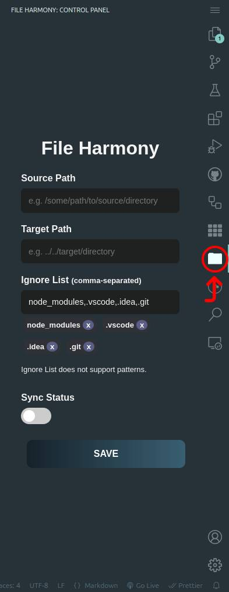

# FileHarmony

A simple vscode extension to keep two directories in sync.

> NOTE: you need **vscode v1.54.0** minimum to install and use this extension.

## How to Use

Simply install the extension. A folder icon should appear on your primary activity bar:

clicking on this icon (highlighted by the red circle) opens the control panel for File Harmony. There are 5 main elements in this panel:

1. **Source Path**: The address (relative or absolute) to the directory where you would want to **copy files from**.
2. **Target Path**: The address (relative or absolute) to the directory where you would want to **paste files to**.
3. **Ignore List**: A list of comma separated directories or files names in the **source path** that need to be ignored.
4. **Sync Status Toggle Switch**: Selects/shows the current sync status (syncing or not).
5. **Save Button**: Saves the configuration.

### Some Notes About This Plugin

There are some gotchas/notes about this plugin that you need to know before using it:

- The "ignore list" does not support patterns/wildcards, **only exact matches**. This is intentional as at my work place I needed things to be very explicit.
- Sync status is workspace-bound. This means that if you turn syncing on, it **(all configuration) will persist** even after closing vscode. However, the syncing will only happen while vscode is up and running (duh!).
- If you leave sync status "on" in a workspace and close vscode, launching vscode again will cause an **immediate directory sync**.
- Syncing is unilateral, therefor changes in the target path do not trigger a sync operation. All such changes will be overwritten the moment a change occurs in the source path.
- Clicking on the "Sync Status" toggle switch alone will not activate the extension. Do NOT forget to click save.
- Using the [Command Palette](https://code.visualstudio.com/api/ux-guidelines/command-palette) in vscode and searching for "File Harmony" you can see two commands: one for toggling sync status on/off and another for showing the current sync status.

## Pull Requests and Contribution?

Most probably not. This is a purely utilitarian extension I developed for my work place. I do not care to actively maintain it.

## License

This extension is under MIT license.